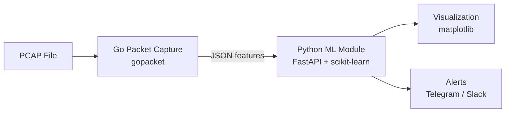
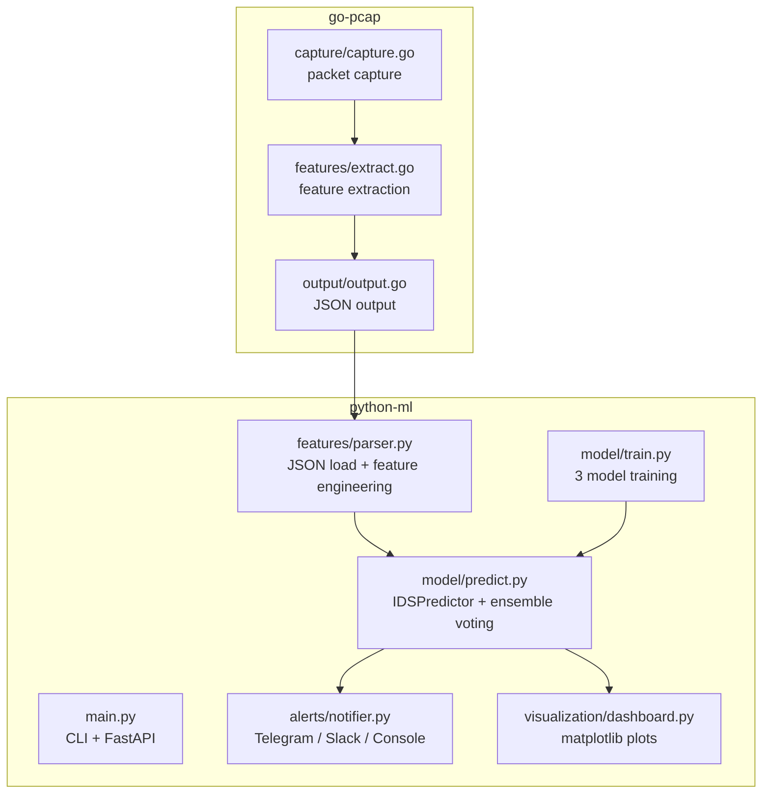
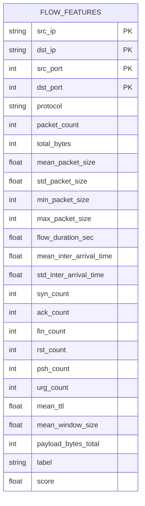
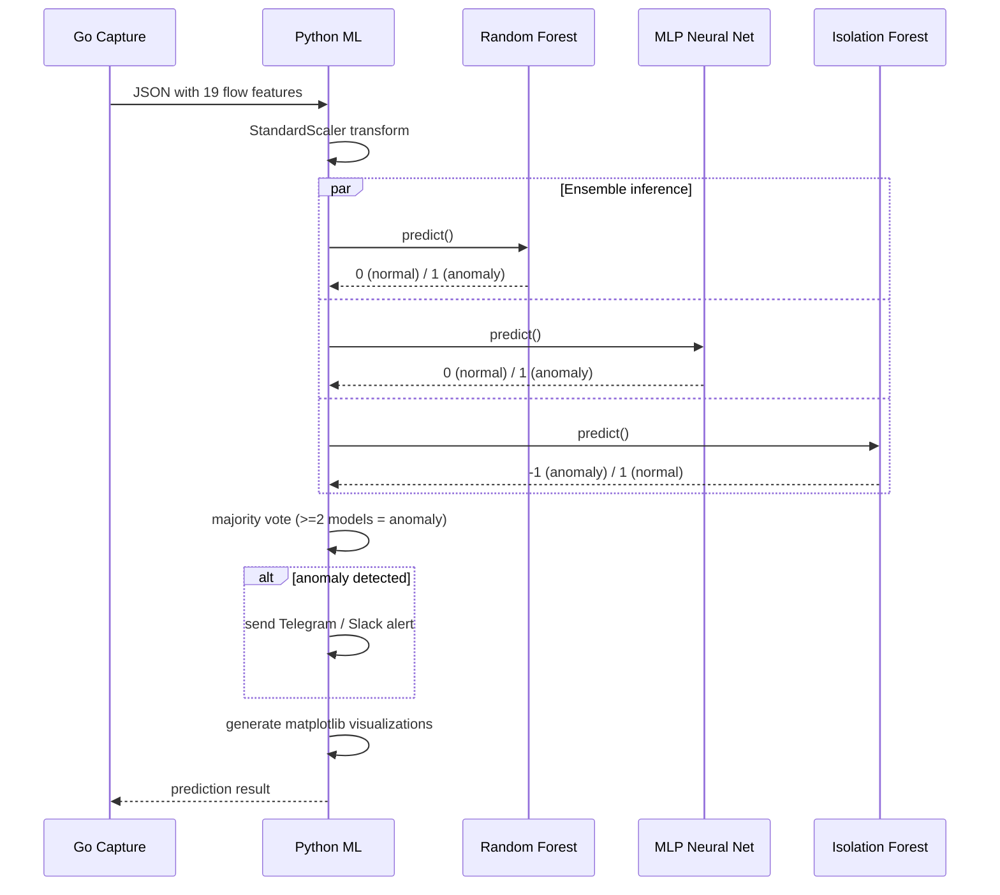

# Курсовая работа по дисциплине «Методы и технологии программирования»

**Вариант 3** — Система обнаружения вторжений (IDS) на основе машинного обучения

---

## Содержание

- [Введение](#введение)
- [1. Аналитическая часть](#1-аналитическая-часть)
- [2. Проектная часть](#2-проектная-часть)
- [3. Технологическая часть](#3-технологическая-часть)
- [4. Реализация](#4-реализация)
- [5. Тестирование](#5-тестирование)
- [Заключение](#заключение)
- [Список использованной литературы](#список-использованной-литературы)
- [Приложения](#приложения)

---

## Введение

### Актуальность

Количество сетевых атак растёт с каждым годом. По данным отчётов по кибербезопасности, миллионы новых вариантов вредоносного ПО и атак появляются ежедневно. Традиционные сигнатурные методы обнаружения (как в Snort) не справляются с zero-day атаками и полиморфными угрозами. Машинное обучение позволяет выявлять аномальное поведение в сети на основе статистических отклонений, не полагаясь на заранее известные сигнатуры.

Система обнаружения вторжений (IDS) на базе ML способна анализировать сетевой трафик в реальном времени, выделять признаки потоков и классифицировать их как нормальные или аномальные, что критически важно для защиты современных инфраструктур.

### Цель

Разработать программный продукт, реализующий полный цикл обнаружения вторжений: захват сетевых пакетов, извлечение признаков, классификацию аномалий с помощью ансамбля ML-моделей и визуализацию результатов.

### Задачи

1. Реализовать модуль захвата сетевых пакетов на Go (live-режим и анализ PCAP-файлов) с извлечением 19 признаков потоков.
2. Разработать модуль на Python с scikit-learn для обучения и предсказания (Random Forest, MLP Neural Network, Isolation Forest).
3. Реализовать ансамблевое голосование (majority voting) для итоговой классификации.
4. Создать REST API на FastAPI для взаимодействия с системой.
5. Внедрить систему алертов (Telegram / Slack / Console) при обнаружении атак.
6. Разработать визуализацию результатов детекции (matplotlib).
7. Покрыть код модульными и интеграционными тестами (pytest).
8. Контейнеризовать приложение через Docker Compose.

---

## 1. Аналитическая часть

### Предметная область

Обнаружение вторжений (Intrusion Detection System, IDS) — область сетевой безопасности, решающая задачу выявления несанкционированной активности в компьютерных сетях. Разделяют два подхода:

- **Сигнатурный анализ** — сравнение трафика с известными шаблонами атак (Signature-based).
- **Аномальный анализ** — выявление отклонений от нормального поведения (Anomaly-based) с помощью статистических и ML-методов.

Данный проект реализует **аномальный подход** с использованием трёх ML-моделей, работающих в ансамбле.

### Классификация сетевых атак

В рамках проекта моделируются и детектируются следующие типы атак:

| Тип атаки | Описание | Характерные признаки |
|---|---|---|
| **SYN Flood** | Заполнение очереди TCP-соединений SYN-пакетами | Высокое число SYN-флагов, малые пакеты |
| **Port Scan** | Сканирование открытых портов | Много соединений с разными портами, RST-флаги |
| **DDoS** | Распределённая атака на отказ в обслуживании | Огромное число пакетов, хаотичные флаги |
| **DNS Amplification** | Усиление DNS-запросов для DDoS | Большие UDP-пакеты, высокий TTL |

---

## 2. Проектная часть

### Архитектура (C4 — уровень контейнеров)



### Архитектура (модули backend)



### ER-диаграмма (структура FlowFeatures)



### Последовательность анализа



---

## 3. Технологическая часть

### Обоснование выбора стека

| Технология | Назначение | Обоснование |
|---|---|---|
| **Go 1.22** | Захват пакетов | Высокая производительность, gopacket, удобная работа с сетью |
| **Python 3.11** | ML + API | Богатая экосистема ML/Data Science |
| **scikit-learn** | ML-модели | Random Forest, MLP, Isolation Forest из коробки |
| **FastAPI** | Web-фреймворк | Async, автодокументация OpenAPI |
| **pandas / numpy** | Обработка данных | Стандарт де-факто для табличных данных |
| **matplotlib** | Визуализация | Гибкие графики, поддержка русского языка |
| **joblib** | Сериализация | Быстрая загрузка/сохранение моделей |
| **requests** | HTTP-клиент | Telegram / Slack API |
| **pytest** | Тестирование | Стандарт Python, фикстуры, параметризация |
| **Streamlit** | Веб-дашборд | Быстрая разработка UI без фронтенд-кода |
| **gopacket** | Захват пакетов | Основная библиотека для работы с PCAP в Go |
| **Docker + Compose** | Контейнеризация | Воспроизводимый запуск |

### Альтернативы, которые рассматривались

- **PySpark ML** вместо scikit-learn — избыточен для учебного проекта, scikit-learn проще и быстрее.
- **TensorFlow/Keras** вместо MLPClassifier — избыточен для мелкой нейросети, sklearn.MLPClassifier достаточно.
- **Grafana** для визуализации — требует отдельного сервера, matplotlib проще для локального запуска.
- **C++** вместо Go для захвата пакетов — Go быстрее в разработке при сопоставимой производительности.
- **libpcap** напрямую (C) вместо gopacket — сложнее в разработке и сборке, gopacket предоставляет высокоуровневый API.

---

## 4. Реализация

### Структура проекта

```
ids-project/
├── go-pcap/                      # Go-модуль захвата трафика
│   ├── capture/capture.go        # Захват пакетов (live + pcap)
│   ├── features/extract.go       # Извлечение признаков потоков
│   ├── output/output.go          # Вывод результатов (JSON/stdout)
│   ├── main.go                   # CLI-точка входа
│   └── go.mod / go.sum           # Go-зависимости
│
├── dashboard/app.py              # Streamlit веб-дашборд
│
├── python-ml/                    # Python-модуль ML + алерты
│   ├── main.py                   # CLI + FastAPI точка входа
│   ├── features/parser.py        # Загрузка и подготовка признаков
│   ├── model/train.py            # Обучение 3 моделей
│   ├── model/predict.py          # Предсказание + ensemble voting
│   ├── alerts/notifier.py        # Telegram / Slack / Console
│   ├── visualization/dashboard.py# Графики (matplotlib)
│   ├── verify.py                 # Скрипт проверки на 10 потоках
│   ├── requirements.txt          # Python-зависимости
│   ├── models/                   # Сохранённые .pkl модели
│   ├── visualizations/           # Сгенерированные графики
│   ├── verify_results/           # Результаты верификации
│   └── tests/                    # 45 тестов (pytest)
│       ├── test_model.py         # 5 тестов
│       ├── test_parser.py        # 15 тестов
│       ├── test_alerts.py        # 9 тестов
│       ├── test_visualization.py # 6 тестов
│       └── test_integration.py   # 10 тестов
│
├── bin/ids-pcap.exe              # Предсобранный Go-бинарник
├── scripts/run.ps1               # PowerShell-скрипт автоматизации
├── docker-compose.yml            # Docker Compose
├── Dockerfile.go                 # Dockerfile для Go-модуля
├── Dockerfile.python             # Dockerfile для Python-модуля
├── .gitignore
└── README.md
```

### Ключевые компоненты

**Go-модуль захвата** ([`go-pcap/main.go`](go-pcap/main.go)) — точка входа, поддерживает live-режим (захват с сетевого интерфейса) и file-режим (анализ PCAP-файла). Использует библиотеку `gopacket` для парсинга пакетов. Позволяет задавать BPF-фильтры и временное окно агрегации. Выделяет из каждого пакета: IP-адреса, порты, протокол, TCP-флаги, TTL, размер окна, полезную нагрузку. Группирует пакеты по потокам (5-tuple) и вычисляет 19 статистических признаков.

**Сервис признаков** ([`python-ml/features/parser.py`](python-ml/features/parser.py)) — загружает JSON от Go-модуля, нормализует данные, кодирует протоколы (TCP→0, UDP→1, ICMP→2, OTHER→3), заполняет отсутствующие колонки нулями. Возвращает DataFrame с 19 признаками, готовый к подаче в модели.

**ML-модуль** ([`python-ml/model/train.py`](python-ml/model/train.py), [`python-ml/model/predict.py`](python-ml/model/predict.py)):
- Генерация синтетических обучающих данных: 6 типов трафика (HTTP, SSH, DNS — норма; SYN Flood, Port Scan, DDoS — аномалии).
- Обучение трёх моделей: **Random Forest** (100 деревьев), **MLP Neural Network** (64→32 нейрона), **Isolation Forest** (100 estimators).
- Предсказание: каждая модель выдаёт свой вердикт, итоговое решение — majority voting (≥2 моделей = аномалия).

**Система алертов** ([`python-ml/alerts/notifier.py`](python-ml/alerts/notifier.py)) — при обнаружении аномалии отправляет форматированное сообщение в Telegram (через Bot API) и/или Slack (через Webhook), а также дублирует в консоль. Определяет тип атаки по характерным признакам (SYN flood: высокий SYN, Port scan: высокий RST).

**Визуализация** ([`python-ml/visualization/dashboard.py`](python-ml/visualization/dashboard.py)) — три вида графиков:
1. Сравнение ключевых признаков по потокам (packet_count, SYN, bytes, mean_size).
2. Оценка аномальности каждого потока + круговая диаграмма распределения.
3. Сравнение результатов трёх моделей.

**Веб-дашборд** ([`dashboard/app.py`](dashboard/app.py)) — интерактивный дашборд на Streamlit с 5 вкладками:
1. **Аналитика** — KPI-метрики точности моделей, отображение графиков детекции.
2. **Предсказание** — форма ручного ввода признаков потока с мгновенной классификацией.
3. **Пакетный анализ** — загрузка JSON с потоками (текст или файл), таблица результатов.
4. **Обучение** — переобучение моделей с выбором количества образцов.
5. **О проекте** — информация о технологиях и архитектуре.

### Запуск

**Локально (Python):**

```bash
cd python-ml
pip install -r requirements.txt
python main.py train --samples 200       # обучение
python verify.py                         # проверка + графики
python main.py api --host 0.0.0.0 --port 8000  # API сервер
```

**Локально (Go):**

```bash
cd go-pcap
go mod tidy
go build -o ../bin/ids-pcap.exe .
./bin/ids-pcap.exe --mode file --file traffic.pcap --output features.json
```

**Веб-дашборд (Streamlit):**

```bash
cd dashboard
streamlit run app.py
```

Дашборд доступен по адресу: [http://localhost:8501](http://localhost:8501)
Вкладки: Аналитика, Предсказание, Пакетный анализ, Обучение, О проекте

**Docker Compose:**

```bash
docker compose up --build
```

После запуска:
- API: [http://localhost:8000](http://localhost:8000)
- Swagger UI: [http://localhost:8000/docs](http://localhost:8000/docs)
- Дашборд: [http://localhost:8501](http://localhost:8501)

---

## 5. Тестирование

### Инструменты

- **pytest** — модульные и интеграционные тесты.

### Покрытие

| Файл | Тестов | Проверяет |
|---|---|---|
| `tests/test_model.py` | 5 | Генерация данных, обучение, предсказание |
| `tests/test_parser.py` | 15 | Загрузка JSON/stdin, кодирование протоколов, missing columns |
| `tests/test_alerts.py` | 9 | Форматирование алертов, Telegram/Slack без токена |
| `tests/test_visualization.py` | 6 | Создание директории, 3 вида графиков, empty data |
| `tests/test_integration.py` | 10 | Полный pipeline, ensemble voting, структура результата |
| **Итого** | **45** | |

### Стратегия тестирования

- **Изоляция:** каждый тестовый класс использует `tempfile.TemporaryDirectory` для изолированного обучения моделей.
- **Mock:** алерты без API-ключей проверяют форматирование без реальной отправки.
- **Графики:** проверяется создание файлов PNG в временной директории.

### Запуск тестов

```bash
cd python-ml
pytest tests/ -v
```

Результат:

```
collected 45 items
tests/test_model.py .....                                            [ 11%]
tests/test_parser.py ...............                                 [ 44%]
tests/test_alerts.py .........                                       [ 64%]
tests/test_visualization.py ......                                   [ 77%]
tests/test_integration.py ..........                                 [100%]
============= 45 passed in 7.02s =============
```

### Результаты детекции

**Тестовые потоки (10 шт: 6 норма + 4 атаки):**

```
Тип трафика                Статус     Оценка    RF    MLP   IF
--------------------------------------------------------------
1. HTTP (веб-сёрфинг)      НОРМА     0.0847    НЕТ   НЕТ   НЕТ
2. HTTPS (защищённый сайт) НОРМА     0.1322    НЕТ   НЕТ   ДА
3. SSH (удалённый доступ)  НОРМА     0.1253    НЕТ   НЕТ   НЕТ
4. DNS (запросы имён)      НОРМА     0.1624    НЕТ   НЕТ   НЕТ
5. FTP (скачивание файла)  НОРМА     0.1229    НЕТ   НЕТ   ДА
6. SMTP (отправка почты)   НОРМА     0.1296    НЕТ   НЕТ   НЕТ
7. SYN-FLOOD (атака)       АНОМАЛИЯ  0.7888    ДА   ДА    НЕТ   <<<
8. PORT SCAN (атака)       АНОМАЛИЯ  0.7697    ДА   ДА    НЕТ   <<<
9. DDoS (атака)            АНОМАЛИЯ  0.9537    ДА   ДА    ДА    <<<
10. DNS Amplification      АНОМАЛИЯ  0.4198    ДА   НЕТ   ДА    <<<
```

**Точность моделей на обучающей выборке:**

| Модель | Точность |
|---|---|
| Random Forest | 100.00% |
| MLP Neural Network | 100.00% |
| Isolation Forest | 59.58% |

---

## Заключение

Разработан программный продукт для обнаружения сетевых вторжений (IDS) на основе машинного обучения. Реализованы все обязательные компоненты из задания: модуль захвата пакетов на Go, ML-модуль на Python с тремя моделями (Random Forest, MLP, Isolation Forest), ансамблевое голосование, REST API на FastAPI, алерты в Telegram/Slack, визуализация через matplotlib, контейнеризация через Docker Compose, тестирование на pytest (45 тестов).

### Перспективы развития

- Интеграция с реальными PCAP-датасетами (CIC-IDS-2017, NSL-KDD) для более реалистичного обучения.
- Глубокое обучение (LSTM/CNN) для анализа временных последовательностей пакетов.
- Веб-интерфейс для мониторинга в реальном времени.
- Поддержка туннелированных протоколов и IPv6.
- Многопоточная обработка для high-speed сетей (>10 Gbps).

---

## Список использованной литературы

1. Макконнелл С. *Совершенный код.* — Microsoft Press, 2023.
2. Столлингс В. *Основы сетевой безопасности.* — Вильямс, 2022.
3. *Документация Python 3.11* — https://docs.python.org/3/
4. *Документация scikit-learn* — https://scikit-learn.org/stable/
5. *Документация FastAPI* — https://fastapi.tiangolo.com/
6. *Документация gopacket* — https://pkg.go.dev/github.com/google/gopacket
7. *Документация pandas* — https://pandas.pydata.org/docs/
8. *Документация matplotlib* — https://matplotlib.org/stable/
9. *Документация Docker* — https://docs.docker.com/
10. *Документация pytest* — https://docs.pytest.org/

---

## Приложения

### Приложение A. Переменные окружения

| Переменная | По умолчанию | Описание |
|---|---|---|
| `TELEGRAM_BOT_TOKEN` | — | Токен Telegram бота для алертов |
| `TELEGRAM_CHAT_ID` | — | ID чата Telegram для алертов |
| `SLACK_WEBHOOK_URL` | — | Webhook URL Slack для алертов |

### Приложение Б. Скриншоты

Файлы скриншотов: каталог `python-ml/visualizations/`.

| Файл | Содержание |
|---|---|
| `feature_comparison.png` | Сравнение признаков (packet_count, SYN, bytes, mean_size) по потокам |
| `anomaly_scores.png` | Оценка аномальности + круговая диаграмма распределения |
| `model_comparison.png` | Сравнение результатов Random Forest, MLP, Isolation Forest |

### Приложение В. Примеры запросов к API

```bash
# Health-check
curl http://localhost:8000/health

# Классификация потока
curl -X POST http://localhost:8000/predict \
  -H "Content-Type: application/json" \
  -d '{"flows": [{"packet_count": 800, "total_bytes": 60000, "mean_packet_size": 60, "std_packet_size": 5, "min_packet_size": 40, "max_packet_size": 80, "flow_duration_sec": 2, "mean_inter_arrival_time": 0.001, "std_inter_arrival_time": 0.0005, "syn_count": 700, "ack_count": 5, "fin_count": 0, "rst_count": 0, "psh_count": 0, "urg_count": 0, "mean_ttl": 64, "mean_window_size": 1024, "payload_bytes_total": 100}]}'

# Получение истории
curl http://localhost:8000/history

# Информация о моделях
curl http://localhost:8000/model

# Статистика
curl http://localhost:8000/stats

# Переобучение
curl -X POST "http://localhost:8000/train?samples=200"
```

### Приложение Г. Состав репозитория

| Файл/каталог | Назначение |
|---|---|
| `go-pcap/` | Go-модуль захвата и анализа пакетов |
| `python-ml/` | Python-модуль: ML, алерты, визуализация, API |
| `dashboard/` | Streamlit веб-дашборд |
| `python-ml/tests/` | 45 тестов (pytest, 5 файлов) |
| `python-ml/models/` | Сохранённые ML-модели (.pkl) |
| `python-ml/visualizations/` | Сгенерированные графики |
| `scripts/` | Скрипты автоматизации |
| `bin/` | Предсобранный Go-бинарник |
| `Dockerfile.go`, `Dockerfile.python` | Docker-образы |
| `docker-compose.yml` | Оркестрация контейнеров |
| `.gitignore` | Исключённые файлы |
| `README.md` | Документация проекта |
